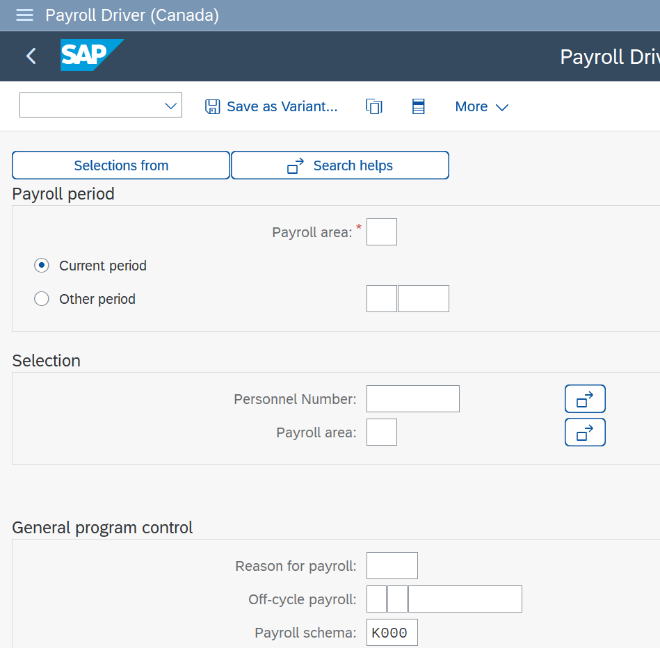
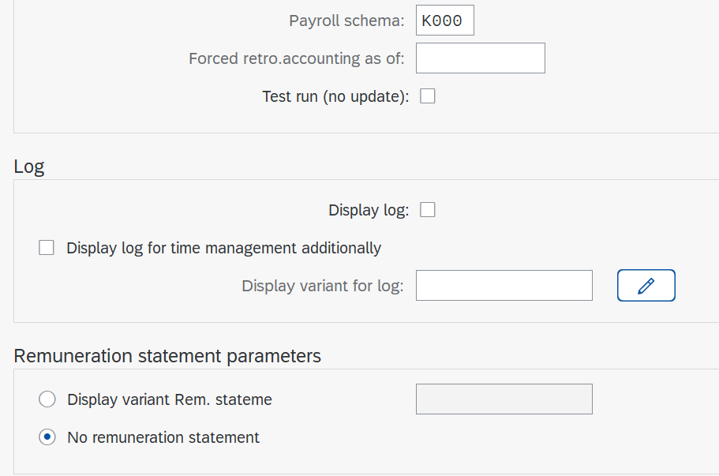

# Payroll Schema Notes

## Table of Contents

* [Payroll Driver](#payroll-driver)
  * [Payroll Driver Canada](#payroll-driver-canada)
  * [Functions of a Payroll Driver](#functions-of-a-payroll-driver)
  * [Schema Structure](#schema-structure)
  * [Payroll Schema Canada](#payroll-schema-canada)
* [Main Schema](#main-schema)
  * [Comments in a Schema](#comments-in-a-schema)
  * [Include a Subschema](#include-a-subschema)
  * [Other Functions of The Main Schema](#other-functions-of-the-main-schema)
    * [BLOCK BEG and BLOCK END](#block-beg-and-block-end)
    * [IF, ELSE, and ENDIF](#if-else-and-endif)

## Payroll Driver

* Canada
  * RPCALCK0
* USA
  * RPCALCU0

[:top:](#table-of-contents)

### Payroll Driver Canada

[:top:](#table-of-contents)

### Functions of a Payroll Driver

* Process standard payroll
* Process offcycle and bonus runs
* Force retroactive payroll runs
* Custom schema

[:top:](#table-of-contents)

### Schema Structure

* main schema contains sub-schemas
* schemas and sub-schemas contain functions
* functions contain rules
* rules contain operations

[:top:](#table-of-contents)

### Payroll Schema Canada

[:top:](#table-of-contents)

## Main Schema

Here we use schema K000 (Canada) for the following dicussions.  Refer to [Payroll Schema Canada](#payroll-schema-canada) for a listing of the main schema.

It is commonly written in documentation that a main schema contains functions.  From a programmer's perspective this may be confusing when first looking at a schema. It's easier to think of a function as a statement and that a schema contains many statments.  In reality, there is ABAP code behind every schema function, so that any given function listed in a schema runs a block of ABAP code.

[:top:](#table-of-contents)

### Comments in a Schema

The function that defines a comment in a schema is **COM**.  Refer to line 10 in schema **K000**.  This is used to add comments and document various parts of the schema.  The **Func.** column contains the text **COM** and the **Text** column contains the comment.

[:top:](#table-of-contents)

### Include a Subschema

In any schema you can include the source of another schema, referred to as a subschema.  The function that does this is the **COPY** function. In line 20 of schema **K000**, the **COPY** function *copies* subschema **KIN0** to schema **K000**.

[:top:](#table-of-contents)

### Other Functions of The Main Schema

> **Note**: It is advised to consult with the SAP F1 Help Documentation for more detailed information above the following functions. Simply put your cursor on the function and hit the F1 key.

[:top:](#table-of-contents)

#### BLOCK BEG and BLOCK END

The BLOCK function allows you to structure the payroll accounting process log. By marking the beginning and end the sequence of payroll functions are grouped together semantically and they appear in the process log under a common node.

**BLOCK BEG** marks the beginning of the block and **BLOCK END** marks the end of the block.

[:top:](#table-of-contents)

#### IF, ELSE, and ENDIF

These functions behave similarly to if/else/endif statments in many popular programming languages, including ABAP.  The **IF** function can handle many conditions.  The conditions are represented by symbolic names or personnel calculation rules.  Conditions represented by symbolic names can be set by other functions or within the logic of the payroll driver.  Consult the F1 help documentation for more information.

[:top:](#table-of-contents)
