# Functional Notes for Payroll Schema K000 using Payroll Driver RPCALCK0

## Table of Contents

* [Main Schema](#main-schema)
* [KIN0](#kin0---initialization-of-payroll)
  * [KIN0 to FIELDS Mapping](#kin0-to-fields-mapping)
  * [KIN0 Payroll Driver Log](#kin0-payroll-driver-log)
* [KBD0](#kbd0---basic-data)
  * [ENAME - Read name](#ename---read-name)
  * [WPBP - Read work place and basic pay](#wpbp---read-work-place-and-basic-pay)
  * [P0002 - Read personal data (NAME/PERM)](#p0002---read-personal-data-nameperm)
  * [P0006 - Read address data (ADR)](#p0006---read-address-data-adr)
  * [ACTIO KSCD - Set WCB indicator](#actio-kscd---set-wcb-indicator)
  * [KTXDM - Read Canadian taxes](#ktxdm---read-canadian-taxes)
  * [Rest of schema KBD0](#rest-of-schema-kbd0)

## Main Schema

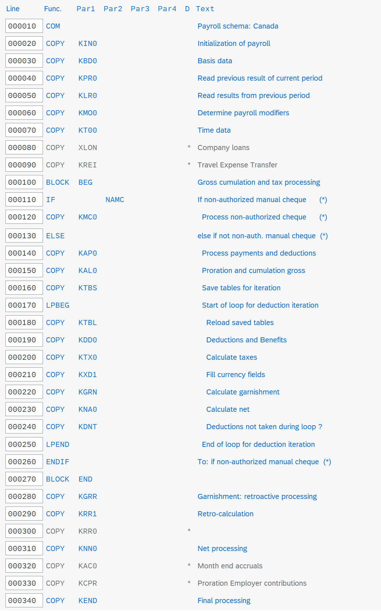

[:top:](#table-of-contents)

## KIN0 - Initialization of payroll

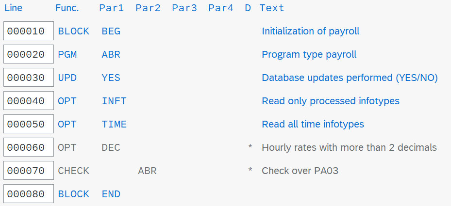

When the schema is generated as below, the triggered schema contains the expanded subschema **KIN0**.  The formatted schema does not.

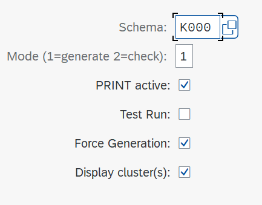

> **Note**: In the following, **JPK1** is a copy of **K000**.  For this section describing schema **KIN0**, schema **JPK1** has only lines 10 and 20 active, with the remaining lines commented out.

The triggered schema shows all expanded nodes which includes the source for **KIN0**.  The triggered schema is stored in table **AS-SOURCE** in the cluster **PCL2(PS)**.  More details about cluster **PCL2(PS)** and what is stored in it will be explained in a later section.

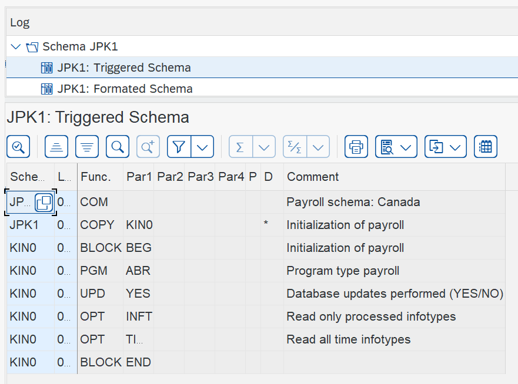

The formatted schema removes the source of **KIN0**.  This is because **KIN0** is a special schema containing unique functions in the sense that there is no ABAP source code attached to them.  These functions only serve to set switches (stored as rows) in table **FIELDS** (described further below), which in turn is stored in cluster **PCL2(PS)**.  The formatted schema is stored in table **AS** in cluster **PCL2(PS)**.  More details about cluster **PCL2(PS)** and what is stored in it will be explained in a later section.

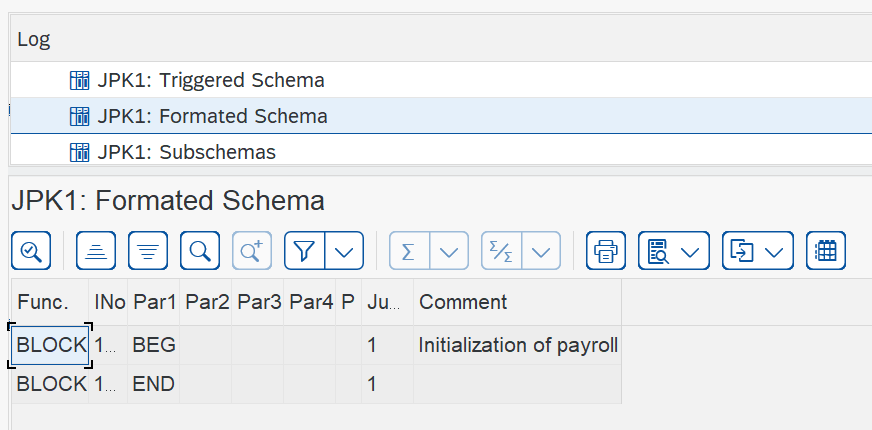

During the generation of the main schema, the source is parsed and finds subschema **KIN0**, which is stored in the log.

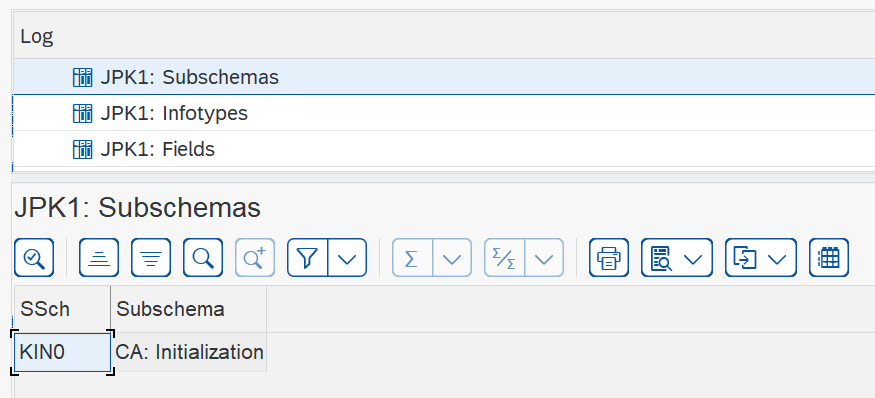

During the generation of the main schema, the source is parsed to find that subschema **KIN0** contains the initializing functions used to set switches for program type, database update, etc.  The generation program parses PGM AGR and knows that the 3 main infotypes required to process payroll are infotypes 0, 1, and 3.  As such, these are stored in table **INFTY** of the cluster **PLC2(PS)** and displayed in the generation log.  More details about cluster **PCL2(PS)** and what is stored in it will be explained in a later section.

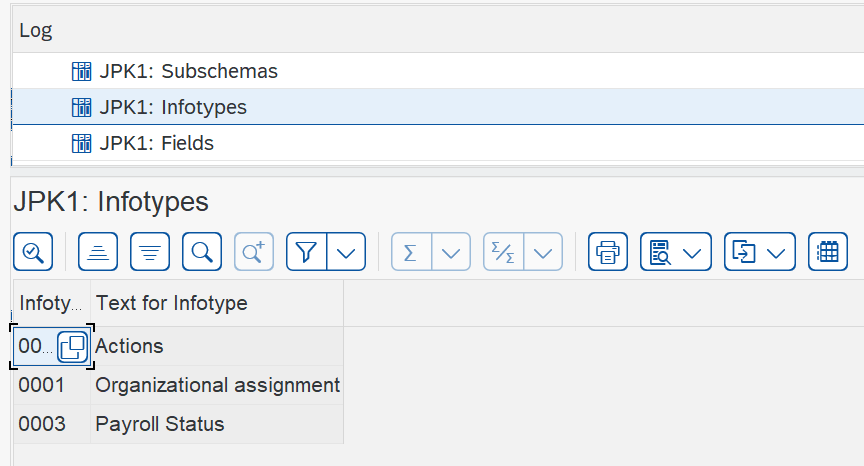

As described previously, the functions of schema **KIN0** only serve to set switches (stored as rows) in table **FIELDS**, which in turn is stored in cluster **PCL2(PS)**.  The switches to be stored in table **FIELDS** are displayed in the log.  The switches have the same name as respective fields in the payroll driver.  That is to say that field **FC-PGM_TYP**, stored in the first column of table **FIELDS**, is defined as a field in payroll driver **RPCALCK0**.  When the cluster **PCL2(PS)** is read into **RPCALCK0**, the table **FIELDS** is read and each corresponding ABAP field in the source could is assigned the value from each respective row.  For example, for the row containing **FC-PGM_TYP** and **ABR**, the ABAP field **fc-pgm_type** will be assigned the value of **ABR**.

> **Note**: For a more detailed look of how this is done in the payroll driver, refer to the page [Technical Notes for Payroll Driver RPCALCK0 using schema K000](payroll_schema_k000_notes.md), section *How the schema source gets read*.

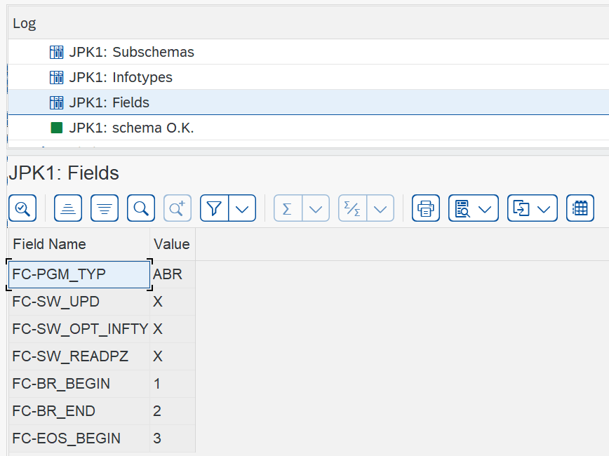

To disable specific switches such as checking the payroll control record, it is required to comment the relevant line of the source of schema **KIN0**.  When they are not commented, the source lines will be stored in table **AS-SOURCE** in cluster **PCL2(PS)** and also appear in the generation log. When they are commented, they will not be stored in table **AS-SOURCE**, nor in the generation log.  Likewise, the same is true for table **FIELDS**.  Only when the respective source line in **KIN0** is not commented will the name of the switch be listed in table **FIELDS**.  A mapping of source line from **KIN0** to field name/value pair in **FIELDS** will be given in the next section.

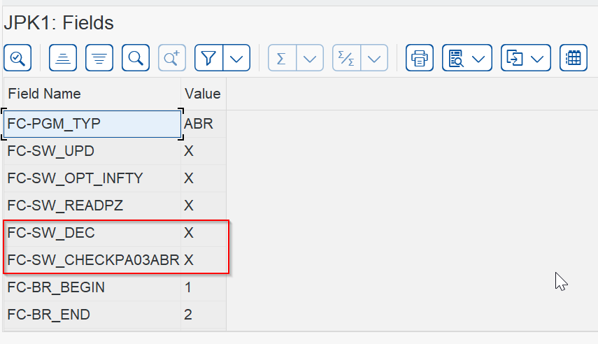

[:top:](#table-of-contents)

### KIN0 to FIELDS Mapping

| KIN0 Line | FIELDS-Name        | FIELDS-Value |
| ----------- | -------------------- | -------------- |
| PGM ABR   | FC-PGM_TYP         | ABR          |
| UPD YES   | FC-SW_UPD          | X            |
| OPT INFT  | FC-SW_OPT_INFTY    | X            |
| OPT TIME  | FC-SW_READPZ       | X            |
| OPT DEC   | FC-SW_DEC          | X            |
| CHECK ABR | FC-SW_CHECKPA03ABR | X            |

[:top:](#table-of-contents)

### KIN0 Payroll Driver Log

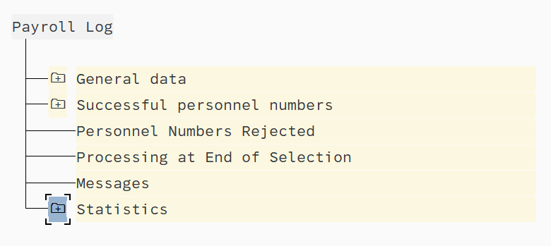

[:top:](#table-of-contents)

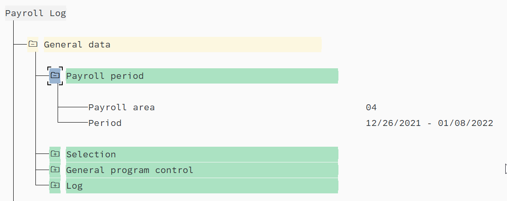

[:top:](#table-of-contents)

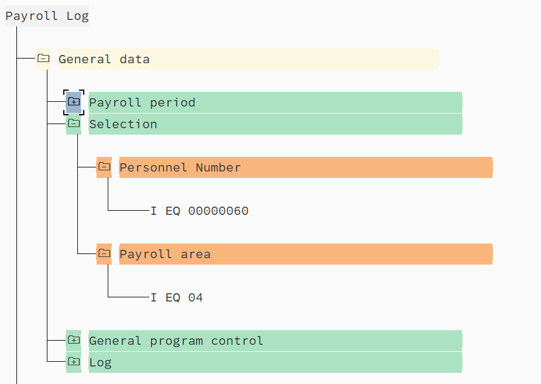

[:top:](#table-of-contents)

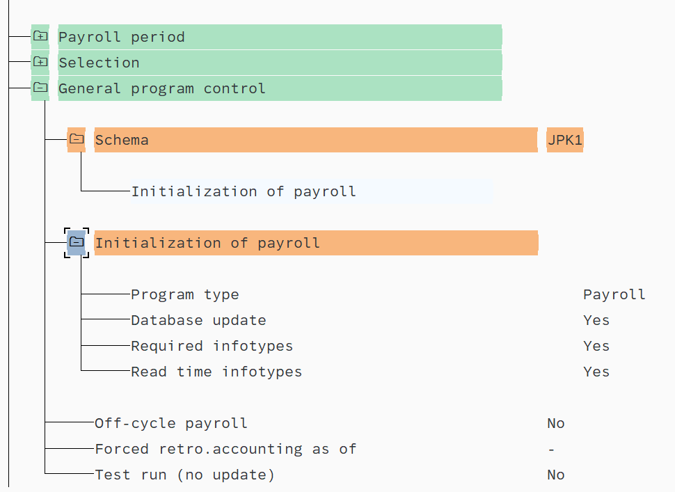

[:top:](#table-of-contents)

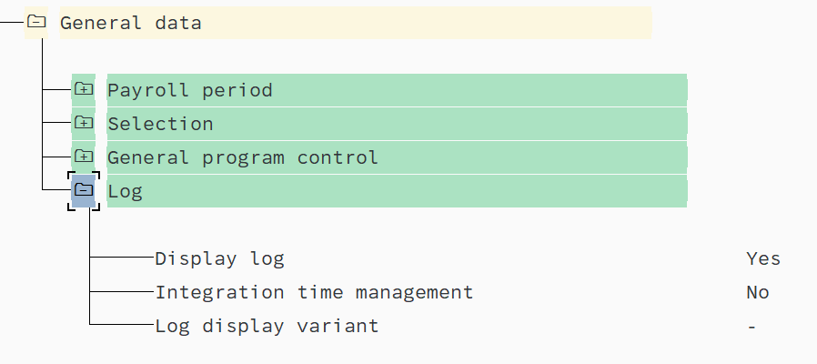

[:top:](#table-of-contents)

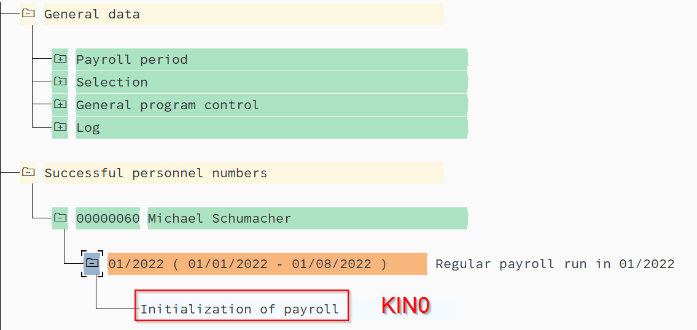

[:top:](#table-of-contents)

## KBD0 - Basic data

| Fct   | Par1 | Par2 | Par3 | Par4 | D | Text                              |
| :------ | :----- | :----- | :----- | :----- | :-- | :---------------------------------- |
| COM   |      |      |      |      |   | Read basic data                   |
| BLOCK | BEG  |      |      |      |   | Reading basic data                |
| ENAME |      |      |      |      |   | Read name                         |
| WPBP  |      |      |      |      |   | Read work place                   |
| P0002 |      |      |      |      |   | Read personal data (NAME/PERM)    |
| P0006 |      |      |      |      |   | Read address data (ADR)           |
| ACTIO | KSCD |      |      |      |   | Clear internal table IT           |
| P0224 |      |      |      |      | * | Read tax information              |
| KTXDM |      |      |      |      |   |                                   |
| GON   |      |      |      |      |   | Continue with complete data       |
| PITAB | S    | BPIT |      |      |   | Save basis pay for tax assessment |
| IF    |      | SPRN |      |      |   | If special run                    |
| RFRSH |      | IT   |      |      |   | Clear internal table IT           |
| ENDIF |      |      |      |      |   | Endif                             |
| DATES |      |      |      |      |   | Providing date specifications     |
| BLOCK | END  |      |      |      |   |                                   |

[:top:](#table-of-contents)

### ENAME - Read name

* Infotypes: 0001,0002
* Input parameters: P0001, P0002
* Output parameters: None
* Code is very straight-forward (use PE04 to view the code)

[:top:](#table-of-contents)

### WPBP - Read work place and basic pay

* Infotypes: 0000,0001,0007,0008,0027,0302
* Input parameters: P0000,P0001,P0007,P0008,P0027
* Output parameters: WPBP,IT,C0,FUND
  * **WPBP** - Workplace/Basic Pay Splits
    * Structure PC205
    * Contains the multiple records pertaining to a payroll period split in any of the following infotypes:
      * P0000,P0001,P0007,P0008
  * **C0** - Cost distribution splits (from IT 0027)
    * Structure PC20A
    * Contains the multiple records pertaining to a cost distribution in infotype P0027
  * **IT** - Wage type table
    * Structure
    * If there are splits in either of WPBP and C0, then a wage type will have many records, with each record referring to the respective split record of WPBP and C0.  This is done by having two specific key fields from IT (one for WPBP and one for C0) that each point to their respective record in WPBP and C0 respectively.
* Performs indirect evaluation of Infotype 8 if indirect evaluation is used to find the pay period salary.

[:top:](#table-of-contents)

### P0002 - Read personal data (NAME/PERM)

[:top:](#table-of-contents)

### P0006 - Read address data (ADR)

[:top:](#table-of-contents)

### ACTIO KSCD - Set WCB indicator

[:top:](#table-of-contents)

### KTXDM - Read Canadian taxes

[:top:](#table-of-contents)

### Rest of schema KBD0

[:top:](#table-of-contents)
