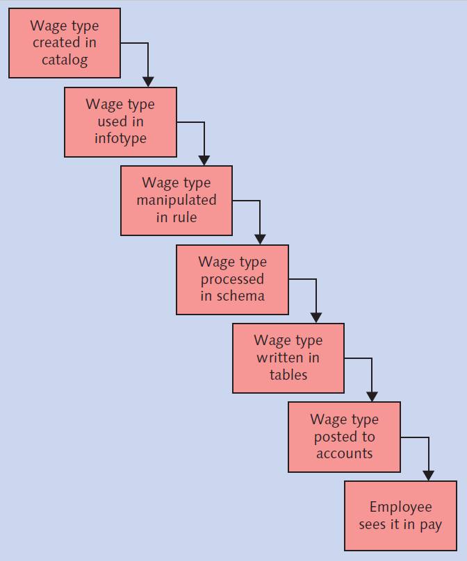

# Wage Type Notes

## Types of Wage Types

* Earnings
  * Infotypes 0008, 0014, 0015
  * Taxable
  * Added to gross wages
* Pre-tax deductions
  * Infotypes 0167, 0169
  * Health Insurance
  * RRSP
* Post-tax deductions
  * Infotypes 0014, 0015
  * Union Dues
* Taxes

## Wage Type Lifecycle

## Input/Output Concepet

## Wage Type Categories

* Dialogue Wage Types
  * 1000 (Basic Pay)
  * Earnings or Deductions
  * Entered through infotypes
* Implementation-Specific Wage Types
  * Implementation-specific wage types that are generated during the payroll process due to a configuration.
  * Wage types for benefits, savings plans, garnishments.
* Technical Wage Types
  * /101 (Total Gross)
  * /110 (Total Deductions)
  * Tax Deductions
  * /559 (Net Pay)

## The Elements Of A Wage Type

* RTE (Rate)
  * Hourly rate
* NUM (Number)
  * Number of hours
* AMT (Amount)
  * Total dollar amount of wage type; for example, pay period salary.

### Wage Type Scenario By Elements

* Basic Pay
  * RTE, NUM, AMT
* RRSP Deduction
  * AMT per month
* Pension earnings
  * AMT, NUM (both hours and amounts are tracked)

## Processing Classes

* Earnings Wage Types
  * Processing Class 59 - related to garnishments
* Deduction Wage Types
  * Processing Class 65 - determines whether a deduction is pre-tax or post-tax

## Cumulation

* YTD/MTD/QTD amounts in payroll cluster

## Permissibility

Permissibility is controlled by:

* Employee subgroup grouping
  * Certain union dues deduction wage types should be permissible only for specific union employees.
  * Certain car allowance wate type should be permissible only for specific executive employees.
* Personnel subarea grouping

## Evaluation Classes

Evaluation classes are used to control the printing of a wage type on a pay stub.

* Some wage types are intermediate wage types in payroll calculations and don't need to be printed o the pay stub.
* Evaluated classes have a two-digit field associated with the wage type.

## Posting

Wage types are posted to FI.  They are posted to expense accounts or balance sheet accounts.

* Basic and overtime pay are posted to payroll expenses.

## Third-party remittance

* Health plan deductions or RRSP deductions sent to benefits provider for third-party remittance processing.
* Tax deductions remitted to tax authoriites.

## Wage Type Catalog

* Use model wage types (starting with M)
* Wage type numbering (must be a number)

## Step-by-Step Configuration of a Wage Type - Summary

### Earnings

| Step | Name                                                     | Table    | IMG Path                                                                                                                                                  | Notes                                                                                           |
| :----- | :--------------------------------------------------------- | :--------- | :---------------------------------------------------------------------------------------------------------------------------------------------------------- | :------------------------------------------------------------------------------------------------ |
| 1    | Create wage type catalog                                 |          | Personnel Management > Payroll Data > {*Earnings Infotype*} > Wage Types > Create wage type catalog > Copy                                                | {*Earnings Infotype*} = Basic Pay, Recurring Payments and Deductions, Additional Payments, etc. |
| 2    | Check wage type text                                     | V_512W_T | Personnel Management > Payroll Data > {*Earnings Infotype*} > Wage Types > Check Wage Type Catalog > Check wage type text                                 | {*Earnings Infotype*} = Basic Pay, Recurring Payments and Deductions, Additional Payments, etc. |
| 3    | Check Entry Permissibility for {*Earnings Infotype*}     | V_T512Z  | Personnel Management > Payroll Data > {*Earnings Infotype*} > Wage Types > Check Wage Type Catalog > Check Entry Permissibility for {*Earnings Infotype*} | {*Earnings Infotype*} = Basic Pay, Recurring Payments and Deductions, Additional Payments, etc. |
| 4    | Define employee subgroup groupings for primary wage type | V_503_G  | Personnel Management > Payroll Data > {*Earnings Infotype*} > Wage Types > Define employee subgroup groupings for primary wage type                       | {*Earnings Infotype*} = Basic Pay, Recurring Payments and Deductions, Additional Payments, etc. |
| 5    | Define personnel subarea grouping for primary wage type  | V_001P_K | Personnel Management > Payroll Data > {*Earnings Infotype*} > Wage Types > Define personnel subarea grouping for primary wage type                        | {*Earnings Infotype*} = Basic Pay, Recurring Payments and Deductions, Additional Payments, etc. |
| 6    | Define Wage Type Permissibility for each PS and ESG      | V_511_B  | Personnel Management > Payroll Data > {*Earnings Infotype*} > Wage Types > Check Wage Type Catalog > Define Wage Type Permissibility for each PS and ESG  | {*Earnings Infotype*} = Basic Pay, Recurring Payments and Deductions, Additional Payments, etc. |
| 7    | Check wage type characteristics                          | V_T511   | Personnel Management > Payroll Data > {*Earnings Infotype*} > Wage Types > Check Wage Type Catalog > Check wage type characteristics                      | {*Earnings Infotype*} = Basic Pay, Recurring Payments and Deductions, Additional Payments, etc. |
| 8    | Adjust the Processing Classes                            | V_512W_D |                                                                                                                                                           | IMG is too cumbersome, so use the customizing table in sm30.                                    |
| 9    | Determine the Cumulation Wage Types                      | V_512W_D |                                                                                                                                                           | IMG is too cumbersome, so use the customizing table in sm30.                                    |
| 10   | Maintain Custom Cumulation                               |          |                                                                                                                                                           | If you need to create new cumulations, you can use unused numbers.                              |

### Deductions

### Taxes
