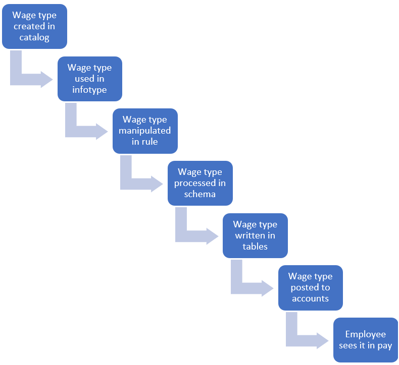
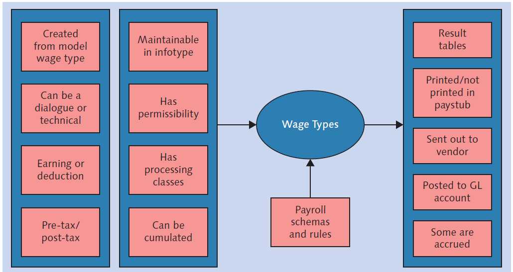
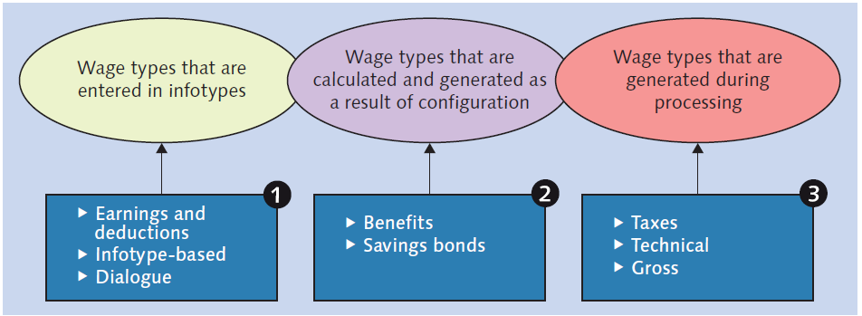
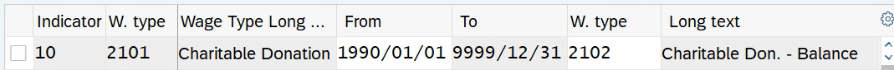
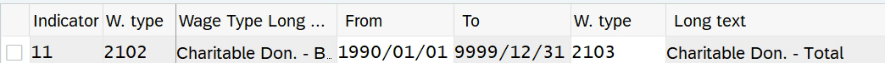
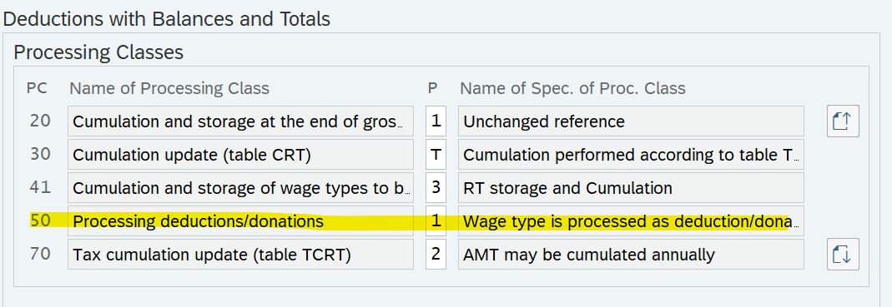
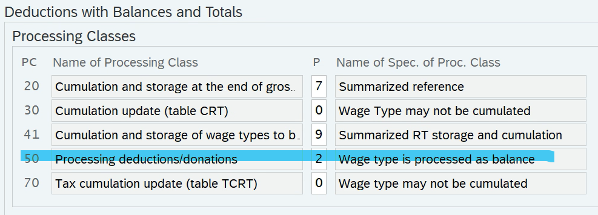
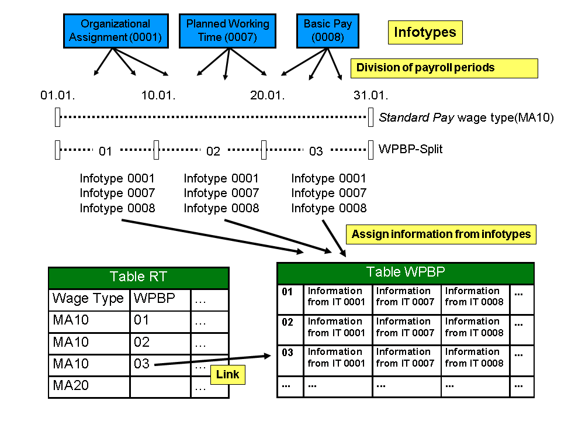
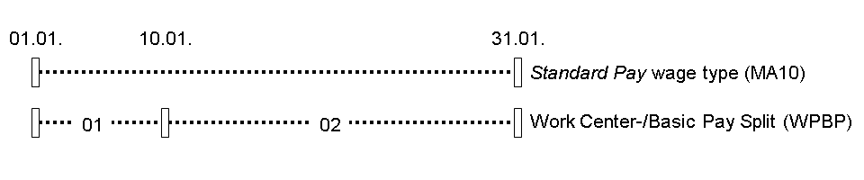
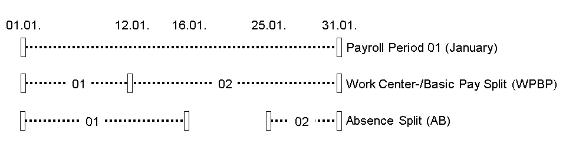

# Wage Type Notes

## Table of Contents

- [Types of Wage Types](#types-of-wage-types)
- [Wage Type Lifecycle](#wage-type-lifecycle)
- [Input/Output Concept](#inputoutput-concepet)
- [Wage Type Categories](#wage-type-categories)
- [The Elements of a Wage Type](#the-elements-of-a-wage-type)
  - [Wage Type Scenario by Elements](#wage-type-scenario-by-elements)
- [Processing Classes](#processing-classes)
- [Cumulation](#cumulation)
- [Permissibility](#permissibility)
- [Evaluation Classes](#evaluation-classes)
- [Posting](#posting)
- [Third-party Remittance](#third-party-remittance)
- [Wage Type Catalog](#wage-type-catalog)
- [Wage Type Tables](#wage-type-tables)
- [Step-by-Step Configuration of a Wage Type - Summary](#step-by-step-configuration-of-a-wage-type---summary)
  - [Steps for Earnings](#steps-for-earnings)
    - [Optional Steps for Earnings](#optional-steps-for-earnings)
    - [Common Processing Classes for Earnings Wage Types](#common-processing-classes-for-earnings-wage-types)
    - [Technical Wage Types Associated with Earnings](#technical-wage-types-associated-with-earnings)
  - [Steps for Deductions](#steps-for-deductions)
    - [Goal/Deduction Linkage](#goaldeduction-linkage)
    - [Common Processing Classes for Deduction Wage Types](#common-processing-classes-for-deduction-wage-types)
    - [Technical Wage Types Associated with Deductions](#technical-wage-types-associated-with-deductions)
- [Wage Type Splits](#wage-type-splits)
  - [Definition of Wage Type Splits](#definition-of-wage-type-splits)
  - [Use of Wage Type Splits](#use-of-wage-type-splits)
  - [Example of Wage Type Splits](#example-of-wage-type-splits)
  - [Structure of Wage Type Splits](#structure-of-wage-type-splits)
  - [Wage Type Split: Example 1](#wage-type-split-example-1)
  - [Wage Type Split: Example 2](#wage-type-split-example-2)
    - [Work Center-/Basic Pay Split](#work-center-basic-pay-split)
    - [Absence Split](#absence-split)
    - [Representation of Split in Payroll Results](#representation-of-split-in-payroll-results)

## Types of Wage Types

* Earnings - grossed into /101
  * Infotypes 0008, 0014, 0015
  * Taxable
  * Added to gross wages
  * Technical wage types for earnings:
    * /101 - Total Gross
    * /102 - Regular taxable income
    * /103 - Non-periodic tax income (eg. bonus payments)
    * /104 - Lump sum payments (eg. death benefits, severance payments)
* Deductions - grossed into wage type /110
  * Pre-tax deductions
    * Infotypes 0167, 0169
    * Health Plan Deductions
    * Dental Plan Deductions
    * RRSP
  * Post-tax deductions
    * Infotypes 0014, 0015
    * Union Dues
* Taxes

## Wage Type Lifecycle

## Input/Output Concepet

## Wage Type Categories

* Dialogue Wage Types
  * 1000 (Basic Pay)
  * Earnings or Deductions
  * Entered through infotypes
* Implementation-Specific Wage Types
  * Implementation-specific wage types that are generated during the payroll process due to a configuration.
  * Wage types for benefits, savings plans, garnishments.
  * Can be pre-tax or post-tax deductions
* Technical Wage Types
  * /101 (Total Gross)
  * /110 (Total Deductions)
  * Tax Deductions
  * /559 (Net Pay)

## The Elements of a Wage Type

* RTE (Rate)
  * Hourly rate
* NUM (Number)
  * Number of hours
* AMT (Amount)
  * Total dollar amount of wage type; for example, pay period salary.

### Wage Type Scenario by Elements

* Basic Pay
  * RTE, NUM, AMT
* RRSP Deduction
  * AMT per month
* Pension earnings
  * AMT, NUM (both hours and amounts are tracked)

## Processing Classes

* Earnings Wage Types
  * Processing Class 59 - related to garnishments
* Deduction Wage Types
  * Processing Class 65 - determines whether a deduction is pre-tax or post-tax

## Cumulation

* YTD/MTD/QTD amounts in payroll cluster

## Permissibility

Permissibility is controlled by:

* Employee subgroup grouping
  * Certain union dues deduction wage types should be permissible only for specific union employees.
  * Certain car allowance wate type should be permissible only for specific executive employees.
* Personnel subarea grouping

## Evaluation Classes

Evaluation classes are used to control the printing of a wage type on a pay stub.

* Some wage types are intermediate wage types in payroll calculations and don't need to be printed o the pay stub.
* Evaluated classes have a two-digit field associated with the wage type.

## Posting

Wage types are posted to FI.  They are posted to expense accounts or balance sheet accounts.

* Basic and overtime pay are posted to payroll expenses.

## Third-party Remittance

* Health plan deductions or RRSP deductions sent to benefits provider for third-party remittance processing.
* Tax deductions remitted to tax authoriites.

## Wage Type Catalog

* Use model wage types (starting with M)
* Wage type numbering (must be a number)

## Wage Type Tables

T511: Wage type characteristics
T512T: Wage type texts
T512W: Wage type valuation
T512Z: Permissibility for infotype
T528C: Valuation
T52D7: Wage type groups
T52DZ: Assignment of model wage type
T52EL: Posting of wage types
T52EZ: Time dependency of posting
T539J: Valuation
T54C3: Cumulation

## Step-by-Step Configuration of a Wage Type - Summary

### Steps for Earnings

> **Note**: For step 1, transaction code **OH11** can be used instead of navigating the IMG path.  An alternative IMG Path for Payroll Canada is *IMG > Payroll > Payroll: Canada >  Basic Settings > Environment for Mainting Wage Types > Create wage type catalog > Copy*

> **Note**: Some of the following steps can also be found under the IMG Path *Payroll > Payroll: Canada >  Basic Settings > Environment for Mainting Wage Types*.  It may make more sense in general to make use of this path instead of the ones given in the table below.

| Step | Name                                                     | Table    | IMG Path                                                                                                                                                  | Notes                                                                                                            |
| :----- | :--------------------------------------------------------- | :--------- | :---------------------------------------------------------------------------------------------------------------------------------------------------------- | :----------------------------------------------------------------------------------------------------------------- |
| 1    | Create wage type catalog                                 |          | Personnel Management > Payroll Data > {*Earnings Infotype*} > Wage Types > Create wage type catalog > Copy                                                | {*Earnings Infotype*} = Basic Pay, Recurring Payments and Deductions, Additional Payments, etc.                  |
| 2    | Check wage type text                                     | V_512W_T | Personnel Management > Payroll Data > {*Earnings Infotype*} > Wage Types > Check Wage Type Catalog > Check wage type text                                 | {*Earnings Infotype*} = Basic Pay, Recurring Payments and Deductions, Additional Payments, etc.                  |
| 3    | Check Entry Permissibility for {*Earnings Infotype*}     | V_T512Z  | Personnel Management > Payroll Data > {*Earnings Infotype*} > Wage Types > Check Wage Type Catalog > Check Entry Permissibility for {*Earnings Infotype*} | {*Earnings Infotype*} = Basic Pay, Recurring Payments and Deductions, Additional Payments, etc.                  |
| 4    | Define employee subgroup groupings for primary wage type | V_503_G  | Personnel Management > Payroll Data > {*Earnings Infotype*} > Wage Types > Define employee subgroup groupings for primary wage type                       | {*Earnings Infotype*} = Basic Pay, Recurring Payments and Deductions, Additional Payments, etc.                  |
| 5    | Define personnel subarea grouping for primary wage type  | V_001P_K | Personnel Management > Payroll Data > {*Earnings Infotype*} > Wage Types > Define personnel subarea grouping for primary wage type                        | {*Earnings Infotype*} = Basic Pay, Recurring Payments and Deductions, Additional Payments, etc.                  |
| 6    | Define Wage Type Permissibility for each PS and ESG      | V_511_B  | Personnel Management > Payroll Data > {*Earnings Infotype*} > Wage Types > Check Wage Type Catalog > Define Wage Type Permissibility for each PS and ESG  | {*Earnings Infotype*} = Basic Pay, Recurring Payments and Deductions, Additional Payments, etc.                  |
| 7    | Check wage type characteristics                          | V_T511   | Personnel Management > Payroll Data > {*Earnings Infotype*} > Wage Types > Check Wage Type Catalog > Check wage type characteristics                      | {*Earnings Infotype*} = Basic Pay, Recurring Payments and Deductions, Additional Payments, etc.                  |
| 8    | Adjust the Processing Classes                            | V_512W_D |                                                                                                                                                           | IMG is too cumbersome, so use the customizing table in sm30.                                                     |
| 9    | Determine the Cumulation Wage Types                      | V_512W_D |                                                                                                                                                           | IMG is too cumbersome, so use the customizing table in sm30.                                                     |
| 10   | Maintain Custom Cumulation                               |          |                                                                                                                                                           | If you need to create new cumulations, you can use unused numbers.                                               |
| 11   | Determine Factoring                                      | V_512W_D |                                                                                                                                                           | Eg. Processing class 10 (Coding wage types for partial period factoring), Specification 1 (Cut with factor /801) |

#### Optional Steps for Earnings

1. Check or set assignment to wage type group.  Every wage type must be assigned to a wage type group. To check the assignment, use the IMG path *Payroll > Payroll: Canada >  Basic Settings > Environment for Mainting Wage Types > Logical views > Check assignment to wage type group*.  Alternatively, use transaction code **PU96**. To set the assignment, use transaction code **PU98**.  This step is generally not needed if the wage type copier is used as in step 1 above.  The wage type copier will copy the same wage type group assignment from the source wage type, so it's important to select an existing wage type that is in the same wage type group that you want the target wage type to be assigned to.

#### Common Processing Classes for Earnings Wage Types

| Processing Class                                | Description                                                                                                                                                                                                                                                                                                                                                                                                                                                                                                                                                                |
| :------------------------------------------------ | :--------------------------------------------------------------------------------------------------------------------------------------------------------------------------------------------------------------------------------------------------------------------------------------------------------------------------------------------------------------------------------------------------------------------------------------------------------------------------------------------------------------------------------------------------------------------------- |
| 1: Valuation                                    | Assignment to bases of valuation. For salary wage types, the specification would be 3 and for hourly wage types, the specification would be 1.                                                                                                                                                                                                                                                                                                                                                                                                                             |
| 3: Cumulation/Storage Time Types                | Cumulating and storing time wage types in RT.  The specification is typically 0 for salary and lump sums.                                                                                                                                                                                                                                                                                                                                                                                                                                                                  |
| 4: Splits                                       | Summarizing wage types according to splits.                                                                                                                                                                                                                                                                                                                                                                                                                                                                                                                                |
| 6: Transfer to LRT                              | Importing wage types from previous payroll account LRT.  Earnings wage types created by the customer are normally set to 0, which means pervious period results are not transferred to to the LRT table. Earnings from previous payroll period are not relevant for the current period. This is also true for non-cumulative wage types; ie.  wage types that don't have a rolling sum from one period to the next (not to be confused with MTD, QTD, YTD cumulations)                                                                                                     |
| 10: Factoring                                   | Coding wage types for partial period factoring. For employees leaving the company in mid-pay-period, used for partial payments. Salary is 1 (Cut with factor /801) and hourly is 0 (Not cut).                                                                                                                                                                                                                                                                                                                                                                              |
| 20: Cumulation/Storage                          | Cumulation and Storage at the end of the Gross Part. After all the wage types from basic pay and other master data infotypes have been finally evaluated, they are cumulated in the collective results and stored in RT.  Salary wage types will have a specification of 3 (RT storage and cumulation) because it is already a pay period sum amount.  Hourly wage types will have a specification of 2 because it is not the hourly wage that is stored, but the salary that is stored.  The horuly wage type is an auxiliary wage type for calculating the gross amount. |
| 30: Cumulation                                  | Cumulation update (table CRT). For salaried earnings, the specification is generally T, in which the cumulation is performed according to table T54C3 (establishes Y and K periods).  For hourly earnings, it is not appropriate to cummulate the amounts; therefore the specification will be 0 (Wage Type may not be cumulated).                                                                                                                                                                                                                                         |
| 31: Division by cost distribution               | Division of monthly lump sums for cost distribution.  Specification is normally 0 (Wage type not necessitating cost center debiting/crediting) for earnings.                                                                                                                                                                                                                                                                                                                                                                                                               |
| 65: Processing of benefits wage types           | Definition of earnings subject to health tax. Specification 1 is common (Wage type is applicable for all provinces)                                                                                                                                                                                                                                                                                                                                                                                                                                                        |
| 67: Income type                                 | The processing class determines what income type should be assigned for a wage type to determine vacationable earnings. For example, for salaried wage types, the specification is E(Regular salary/wages/retroactive), for hourly wage types, the specification is blank, for bonus payment it's 2 (Bonuses (cash) - discretionary), etc.                                                                                                                                                                                                                                 |
| 69: Taxable Earning or Non-taxable Contribution | The specification should match the wage type.  For example, F (Regular salary of wages/overtime) for salary, blank for hourly wage, 3 (Bonuses (cash) - work related) for bonuses.                                                                                                                                                                                                                                                                                                                                                                                         |
| 76: Special payroll run                         | Determine if the wage types from P0014 and P0015 are taken for the special payroll run or not.  Salary and hourly wage types are blank and bonus wage types are 1 (Wage type is for special run (e.g. bonus)).                                                                                                                                                                                                                                                                                                                                                             |
| 84: Definition of PPIP insurable earnings       | This processing class is used to determine whether the wagetype is eligible for Provincial Parental Insurance Plan (PPIP) earnings. Most earnings are eligible (1).  This specification doesn't apply to hourly wage types since it's the salary that is eligible and not the hourly wage.                                                                                                                                                                                                                                                                                 |

#### Technical Wage Types Associated with Earnings

| Technical Wage Type | Relationship to Earnings                                                                                                                                                                                                                                                                  |
| :-------------------- | :------------------------------------------------------------------------------------------------------------------------------------------------------------------------------------------------------------------------------------------------------------------------------------------ |
| /101                | Gross wages: Earnings are cumulated to /101; as such, the cumulation class 1 for earnings should be selected.                                                                                                                                                                             |
| /102                | Regular Taxable Income: All wage types subjected to Federal Income Tax and Provincial (territorial) tax under the general tax formula for periodic payments are cumulated here. (Excluding Quebec Provincial Tax)                                                                         |
| /103                | Non periodic tax income: All wage types such as bonus, a retroactive pay increase or other non-perodic payments, are subject to an aggregrate tax calculation formula for non-periodic payments; as specified for tax factor TB in the Payroll Deductions Formulas for Computer Programs. |
| /104                | Lunp sum payments: Used to process the disbursement of lump sum payments (such as death benefits or severance payments) to employees or employee beneficiaries.                                                                                                                           |

### Steps for Deductions

> **Reminder**: Deduction wage types can fall into one of two boxes, and they can either be input through infotypes or generated by configuring deductions such as benefits, savings bonds, and garnishments.

Steps for creating and configuring deduction wage types that are entered into infotypes are similar to the steps for earnings wage types, expect that the {*Earnings Infotype*} placeholder is replaced by a {*Deduction Infotype*} placeholder.  Therefore, follow the steps for earnings wage types.

Deduction wage types may have additional steps:

#### Goal/Deduction Linkage

In Canadian Payroll, you will often have a situation where a regular per-pay deduction has a certain goal amount (also called a balance) and stops when the goal amount is reached. The goal amount is stored in Infotype 15.  Here the balance wage type is specified along with the goal (balance) amount.  The deduction amount is stored in Infotype 14.  Here the deduction wage type is specified along with the per-pay deduction amount. After processing payroll, all 3 wage types will be displayed - the deducted wage type and amount, the balance wage type and amount, and the totals wage type and amount.

For example,

Here, wate type 2101 is the deduction wage type, 2102 is the balance wage type, and 2103 is the totals wage type.

In Infotype 14, wage type 2101 can be $25 per pay period.
In Infotype 15, wage type 2102 can be $250.

After processing payroll, the 3 wage types will be written to the results like so:

> 2101  25.00-
> 2102 225.00-
> 2103  25.00-

Note that the balance is no longer $250, but $225.

The following sample steps should be used to manage these paid wage types.

> **Note**: these steps are for a particular customer scenario.  The actual wage types and values will be different from system to system and customer to customer.  You will have to find something similar in the system you are working with.

1) IMG > *Payroll > Payroll Canada > Deductions > Wage Types for Deductions with Balances and Totals > Assign processing classes to wage types > Maintain link between wage types*
2) Scroll down to the row that has indicator 10 and wage type 2101 (Charitable Donation).  Notice that the indicator for this row is 10, which establishes a link between a **deduction wage type** and a **balance wage type**.  In this case, the deduction wage type is 2101 and the balance wage type is 2102 (Charitable Don. - Balance).
   
3) Scroll down to the row that has indicator 11 and wage type 2102 (Charitable Don. - Balance). Notice that the indicator for this row is 11, which establishes a link between a **balance wage type** and a **totals wage type**.  In this case, the balance wage type is 2102 and the totals wage type is 2103 (Charitable Don. Total).
   
4) IMG > *Payroll > Payroll Canada > Deductions > Wage Types for Deductions with Balances and Totals > Assign processing classes to wage types > Assign processing classes to wage types*
5) Here you will set the processing class 50 (Processing deductions/donations)to the relevant specification for the deduction wage type and the balance wage type. For the deduction wage type the specification value should be set to 1 (Wage type is processed as deduction/donation).  For the balance wage type the specification value should be set to 2 (Wage type is processed as balance).  For the totals wage type, the processing class is not set.

   Deductions Wage Type:
   

   Balance Wage Type:
   

#### Common Processing Classes for Deduction Wage Types

| Processing Class                  | Description                                                                                                                                                                                                                                                                                                                                                                                                                                                               |
| :---------------------------------- | :-------------------------------------------------------------------------------------------------------------------------------------------------------------------------------------------------------------------------------------------------------------------------------------------------------------------------------------------------------------------------------------------------------------------------------------------------------------------------- |
| 3: Cumulation/Storage Time Types  | Cumulating and storing time wage types in RT.  A common specification is 0 for pay-period deductions, as they need to be passed on to calculate the gross amount from the time amount.                                                                                                                                                                                                                                                                                    |
| 4: Splits                         | Summarizing wage types according to splits. Deductions from infotype 15 generaly are not split, simply transferred for further processing, and so have a specification of 6.                                                                                                                                                                                                                                                                                              |
| 6: Transfer to LRT                | Importing wage types from previous payroll account LRT.  Deduction wage types created by the customer are normally set to 0, which means pervious period results are not transferred to to the LRT table. Deductions from previous payroll period are not relevant for the current period. This is also true for non-cumulative wage types; ie.  wage types that don't have a rolling sum from one period to the next (not to be confused with MTD, QTD, YTD cumulations) |
| 10: Factoring                     | Coding wage types for partial period factoring. For employees leaving the company in mid-pay-period, used for partial payments. Many customer defined deduction wage types are typically 0 (No cut).                                                                                                                                                                                                                                                                      |
| 20: Cumulation/Storage            | Cumulation and Storage at the end of the Gross Part. After all the wage types from basic pay and other master data infotypes have been finally evaluated, they are cumulated in the collective results and stored in RT.  Deduction wage types will have a specification of 1 (pass on unchanged) because they need to be transferrred unchanged to the net part of calculation.                                                                                          |
| 30: Cumulation                    | Cumulation update (table CRT). For deduction wage types, the specification is generally T, in which the cumulation is performed according to table T54C3 (establishes Y and K periods).  This is similar to earnings wage types, such as salary.                                                                                                                                                                                                                          |
| 31: Division by cost distribution | Division of monthly lump sums for cost distribution.  Specification is normally 0 (Wage type not necessitating cost center debiting/crediting) because this usually applied to earnings such as paid leaves.                                                                                                                                                                                                                                                              |

#### Technical Wage Types Associated with Deductions

| Technical Wage Type | Relationship to Deductions |
| :-------------------- | :--------------------------- |
| /110                | Net payments/deductions    |

## Wage Type Splits

### Definition of Wage Type Splits

Links from a wage type in table RT (results table) to other tables of the payroll result.

### Use of Wage Type Splits

The wage types and some relevant information are stored in table RT. They can be linked with additional information in other tables using wage type splits. These links are created using a two-character split indicator.

The wage type split defines changes to infotypes for the exact day and indicates these periods in the payroll results using the split indicator.

### Example of Wage Type Splits

The Work Center-/Basic Pay Split (WPBP-Split) provides a link to table WPBP:

### Structure of Wage Type Splits

| Wage Type Split                            | Use                                                                                                                                              |
| :------------------------------------------- | :------------------------------------------------------------------------------------------------------------------------------------------------- |
| Work Center-/ Basic Pay Split (WPBP-Split) | an employee's work center and/or basic pay change within a payroll period                                                                        |
| Cost Accounting Split (C1 Split)           | an employee's assignment to a cost center changes within a payroll period                                                                        |
| Split for Different Payments (ALP Split)   | an employee carries out substitution during a payroll period and is remunerated differently than normal.                                         |
| Absence Split (AB-Split)                   | an employee is absent once or several times (for example, leave or illness) during a payroll period.                                             |
| Bank Transfer Split (BT Split)             | A transfer exists for a wage type. Information on this transfer is found in table BT                                                             |
| Variable Split (VO Split)                  | there is special information available for an employee for a payroll period, for example, information on a garnishment, a loan, or a company car |
| Country-specific splits                    | there is country-specific information available for an employee for tax, social insurance and so on.                                             |

### Wage Type Split: Example 1

An employee's standard pay is changed on January 10 in the **Basic Pay** (0008) infotype:

Wage type MA10 is available with a Work Center-/Basic Pay Split (WPBP-Split). The WPBP-split covers two partial periods that are indicated in the payroll results with split indicators:

| Start date | End date | Wage type | AP |
| ------------ | ---------- | ----------- | ---- |
| 01.01.     | 09.01.   | MA10      | 01 |
| 10.01.     | 31.01.   | MA10      | 02 |

### Wage Type Split: Example 2

An employee's standard pay is changed on January 12 in the **Basic Pay** (0008) infotype: A Work Center-/ Basic Pay Split (WPBP-Split) is created as a result. The employee also takes leave twice in this payroll period. Wage type AB01 is generated to calculate the absences. An Absence Split (AB-Split) exists for this wage type.

Wage type AB01 is taken from the system and split up among the WPBP periods. Wage type AB01 is available with a Work Center-/Basic Pay Split (WPBP-Split) **and** an Absence Split (AB-Split). Both the WPBP-split and the AB-split cover two partial periods that are indicated in the payroll results with split indicators:

#### Work Center-/Basic Pay Split

| Start date | End date | Wage type | AP |
| ------------ | ---------- | ----------- | ---- |
| 01.01      | 11.01.   | ABO1      | 01 |
| 12.01.     | 31.01.   | ABO1      | 02 |

#### Absence Split

| Start date | End date | Wage type | AB |
| ------------ | ---------- | ----------- | ---- |
| 01.01.     | 15.01.   | ABO1      | 01 |
| 25.01.     | 31.01.   | ABO1      | 02 |

#### Representation of Split in Payroll Results

| Start date | End date | Wage type | AB | AP |
| ------------ | ---------- | ----------- | ---- | ---- |
| 01.01.     | 11.01.   | ABO1      | 01 | 01 |
| 12.01.     | 15.01.   | ABO1      | 01 | 02 |
| 25.01.     | 31.01.   | ABO1      | 02 | 02 |
